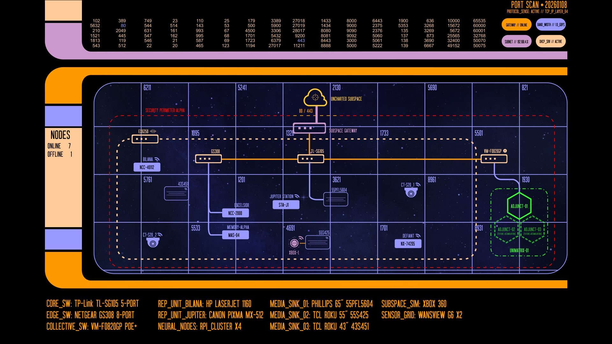

# 🖖 SECTOR 004 // JOINT STRATEGIC COMMAND

## 📡 Tactical Overview: Mission Directive
**MISSION DIRECTIVE:** To exercise supreme command over the integrated assets of Sector 004. This facility serves as the nexus 
between Federation administrative protocols and the Borg Collective's computational efficiency. By maintaining a 
Joint Strategic Command, we ensure the seamless interoperation of diverse hostnames — from the archival depths of 
Memory Alpha to the distributed processing power of the Hive. All operations are conducted under a hardened security 
posture to preserve the integrity of the quadrant.

---

## 🗺️ System Topology

  

*Figure 1.0: Logical mapping of the Sector 004 Perimeter. Click image to enlarge tactical view.*

---

## 🛡️ Security Posture: CONDITION RED
The Sector 004 perimeter is currently hardened against external intrusion.
* **Shield Status:** ENERGIZED (Active Filtering)
* **Inbound Aperture:** Ports 80 (HTTP) and 443 (HTTPS) only.
* **Security Purge:** Port 21 (FTP) has been decommissioned. External transport is strictly limited to SSL-encrypted channels.

---

## 🚢 Fleet Manifest & Uplink Frequencies

| Designation         | Registry           | Frequency (IP)  | Mission / Services                                                        |
|:--------------------|:-------------------|:----------------|:--------------------------------------------------------------------------|
| **Excelsior**       | `NCC-2000`         | `192.168.4.30`  | :green_circle: Command & Control / Primary Workstation                    |
| **Defiant**         | `NX-74205`         | `DHCP`          | :green_circle: Command & Control / Mobile Workstation                     |
| **Memory Alpha**    | `MAS-04`           | `192.168.4.190` | :green_circle: Central Core: Odoo, Penpot, Solr, Navidrome, Samba         |
| **Bilana**          | `NCC-40112`        | `192.168.4.182` | :green_circle: Industrial Replicator: HP LaserJet 1160 (CUPS)             |
| **Jupiter Station** | `STA-J1`           | `192.168.4.181` | :green_circle: Industrial Replicator: Canon MX-512 Multi-function printer |
| **The Hive**        | `UNIMATRIX-01`     | `192.168.4.220` | :green_circle: Collective Queen: K3s Control Plane                        |
| **Adjunct-01**      | `ADJUNCT-01`       | `192.168.4.221` | :green_circle: Worker Node: Containerized Workloads                       |
| **Phillips TV**     | `MEDIA_SINK_01`    | `DHCP` | :green_circle: Master Viewscreen                                          |
| **TCL TV**          | `MEDIA_SINK_02/03` | `DHCP` | :green_circle: Secondary Visual Relays                                    |
| **Xbox One**        | `SUBSPACE_SIM`     | `DHCP` | :green_circle: Tactical Simulation                                        |
| **1080p Tactical Sensor**     | `CT-S20-1`         | `DHCP` | :green_circle: Internal Security Grid                                     |
| **1080p Tactical Sensor**     | `CT-S20-2`         | `DHCP` | :green_circle: Internal Security Grid                                     |

---

## 📚 Technical Library
Detailed schematics and installation logs for each sector:

* 🛰️ [Core Network Schematics](./docs/core-network.md) - Switch and Gateway Config
* 🛰️ [Workstation Schematics](./docs/workstations.md) - Workstations Configuration and Application
* 🏛️ [Memory Alpha Services](./docs/memory-alpha.md) - Application Layer (Odoo/Navidrome)
* 🖨️ [Replication Protocols](./docs/replica-units.md) - Peripheral Integration
* 🧠 [Unimatrix Cluster Setup](./docs/unimatrix-cluster.md) - K3s and Node Configuration
* 📺 [Media & Visual Arrays](./docs/media.md) - Entertainment Integration 
* 🛡️ [Internal Security Grid](./docs/security.md) - Security Sensor Telemetry

## The Federation

The Federation layer of Sector 004 consists of the primary command and support infrastructure. These nodes represent the 
legacy of the fleet — reliable, multi-functional, and serving as the backbone for the sector's administrative, R&D, 
and replicator services. From the central archive at Memory Alpha to the specialized replicator hub at Jupiter Station, these assets 
provide the essential stability required to govern the quadrant's data flow.

### Excelsior

The primary command and control asset. As the flagship of the Sector 004 fleet, 
Excelsior serves as the Admiral's interface for high-level design, secure terminal access, and the architectural 
development of the Joint Command grid.

### Defiant

The fleet's primary escort and mobile reconnaissance unit. Defiant provides a high-performance, portable bridge for 
field operations, ensuring that Command can maintain a subspace uplink to the archives even when stationed outside the 
primary sector.

> 🖥️ **LINK ESTABLISHED:** [Workstation Manual & Command Protocols](./docs/workstations.md)

### Memory Alpha

The central hub and data repository for Sector 004, housing the Odoo ERP, Penpot design assets, and the Navidrome sonic 
archives. It acts as the "Grand Library" for all Federation and Joint operations.

> 🏛️ **ARCHIVE ACCESS:** [Service Manifest & Database Config](./docs/memory-alpha.md)

### Bilana

A dedicated industrial research outpost. Operating as a high-reliability replicator station, Bilana manages the 
HP LaserJet 1160 interface, translating digital schematics into physical tactical hardcopy for the fleet.

### Jupiter Station

The sector's advanced multi-function research and development facility. Jupiter Station expands the fleet's replicator 
capabilities with the Canon MX-512, providing high-resolution imaging (scanning) and subspace wireless relay protocols 
to support all nearby vessels.

> 🖨️ **REPLICATION LOGS:** [Industrial Replicator Protocols](./docs/replica-units.md)

---

## The Borg Collective

Designated as The Hive, this segment of the network represents a unified, distributed intelligence. By assimilating
Raspberry Pi hardware into a singular K3s orchestration fabric, I have eliminated the inefficiency of the individual.
All drones within the Hive operate in total synchronization, sharing resources and computational loads to ensure that
service downtime is non-existent. In the Collective, there is no "self," only the Cluster.

> 🛰️ **ACCESS NEURAL LINK:** [Hive Details & K3s Configuration](./docs/unimatrix-cluster.md)

